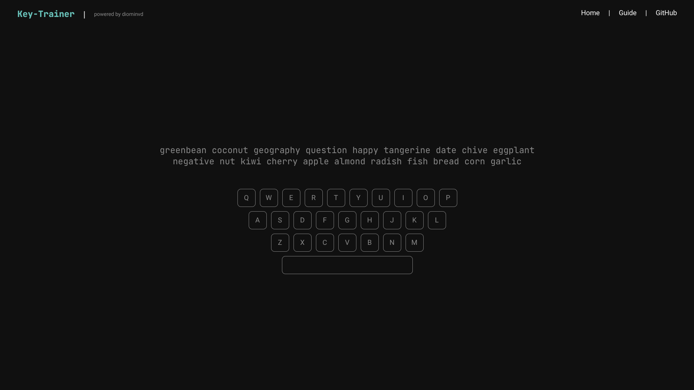

# key-trainer



Touch-typing trainer with real-time feedback, a virtual on-screen keyboard, and post-exercise statistics. Built with React, TypeScript, and Vite.

## Table of Contents
* [Features](#features)
* [Tech Stack](#tech-stack)
* [Requirements](#requirements)
* [Installation & Setup](#installation--setup)
* [Quick Start](#quick-start)
* [Available Scripts](#available-scripts)
* [Project Structure](#project-structure)
* [License](#license)

## Features
* Bilingual layouts — English (QWERTY) and Russian (ЙЦУКЕН), switch with `Ctrl`.
* Random word generation from built-in dictionaries (100+ English, 200+ Russian words).
* Adjustable text length — scroll the mouse wheel to increase or decrease word count.
* Real-time feedback — correct keystrokes highlighted in the primary color, incorrect ones in red.
* Virtual on-screen keyboard — reflects the active layout with press feedback (green / red).
* Live statistics — speed (CPM), accuracy (%), misprint count, and elapsed time while you type.
* Results overlay — view your performance after completing the text; press `Enter` to restart.

## Tech Stack

| Layer      | Technology                                                              |
| ---------- | ----------------------------------------------------------------------- |
| Language   | [TypeScript](https://www.typescriptlang.org/) (strict mode)             |
| UI Library | [React 18](https://react.dev)                                           |
| Build Tool | [Vite](https://vite.dev)                                                |
| Routing    | [React Router 6](https://reactrouter.com)                               |
| Styling    | SCSS ([sass-embedded](https://www.npmjs.com/package/sass-embedded))     |
| Linting    | [ESLint](https://eslint.org) with TypeScript & React plugins            |

## Requirements
* [Node.js](https://nodejs.org) >= 20
* Or [Docker](https://docker.com) for the containerized option

## Installation & Setup

### Option A — Without Docker

```bash
git clone https://github.com/diominvd/key-trainer.git
cd key-trainer

npm install
npm run dev
```

### Option B — With Docker

```bash
git clone https://github.com/diominvd/key-trainer.git
cd key-trainer

docker compose up --build
```

Then open [http://localhost:5173](http://localhost:5173) in your browser.

## Quick Start

```bash
git clone https://github.com/diominvd/key-trainer.git
cd key-trainer
npm install
npm run dev
```

Open [http://localhost:5173](http://localhost:5173), select your layout, and start typing.

## Available Scripts

| Script            | Description                                              |
| ----------------- | -------------------------------------------------------- |
| `npm run dev`     | Start the Vite development server.                       |
| `npm run build`   | Type-check with `tsc` and build for production to `dist/`. |
| `npm run preview` | Preview the production build locally.                    |
| `npm run lint`    | Run ESLint on all `.ts` / `.tsx` files.                  |

## Project Structure

```
src/
├── app/
├── config/
├── modules/
├── pages/
│   └── Home/
│       ├── Home.tsx
│       └── components/
│           ├── Keyboard/
│           ├── Result.tsx
│           └── TrainingText/
├── providers/
├── styles/
├── ui/
└── utils/
```

| Path | Description |
| --- | --- |
| `src/app/` | Root component (`App.tsx`). |
| `src/config/` | Keyboard layouts, routes, types, and word dictionaries. |
| `src/modules/` | Reusable feature modules (e.g., `Header`). |
| `src/pages/` | Page components and their sub-components. |
| `src/pages/Home/components/Keyboard/` | Virtual on-screen keyboard component. |
| `src/pages/Home/components/Result.tsx` | Results overlay shown after completing the text. |
| `src/pages/Home/components/TrainingText/` | Training text display with per-character feedback. |
| `src/providers/` | React Context providers (`TrainingProvider`). |
| `src/styles/` | Global styles, themes, and component SCSS files. |
| `src/ui/` | Primitive UI components (`Layout`, typography). |
| `src/utils/` | Helper functions (e.g., `generateRandomText`). |

## License

This project is licensed under the MIT License — see the [LICENSE](LICENSE) file for details.
